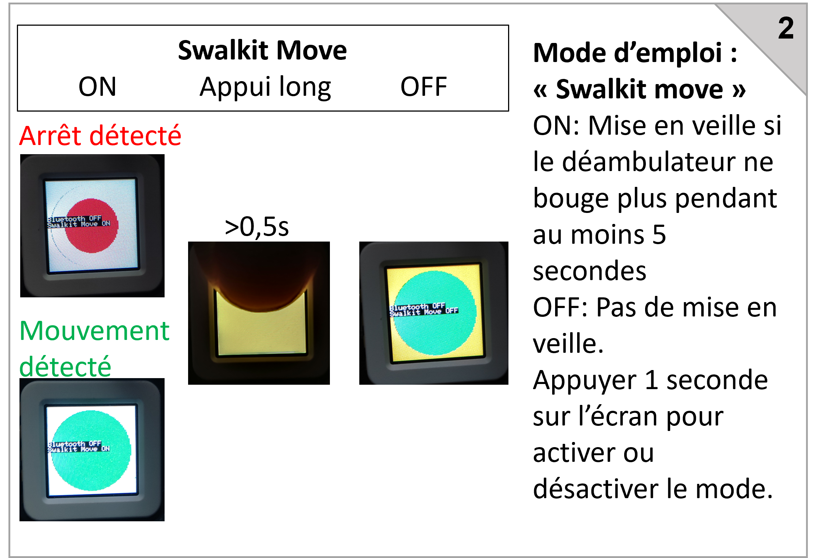

https://user-images.githubusercontent.com/100538879/157646195-c86fd216-0dd4-412f-9931-ac7addbbb123.mp4

> **Liability  
All documentation is provided "as is", Chair IH2A provides no warranty of any kind, whether express, implied or statutory, including, but not limited to, any warranty of merchantability or fitness for a particular purpose or any warranty that the content of the articles will be error free. In no event shall Chair IH2A be liable for any direct or indirect damages, or any damages whatsoever arising from the use of project documentation shared on this platform.**

> **Warning  
The objects/projects presented on this platform are for information, teaching and exploration of the possibilities of fablab prototyping ONLY. Their display does not constitute professional advice on their use, nor does it replace the opinion of a medical or paramedical specialist, who alone is in a position to evaluate, advise and propose materials, printed or not, corresponding to a precise and personal situation and needs, following the completion of a complete assessment**.

> **The IH2A Chair's Github ([https://github.com/IH2A/](https://github.com/IH2A/)) and all the other platforms associated with the documentation of our projects (the IH2A Chair's communication site, [https://ih2a.insa-rennes.fr/](https://ih2a.insa-rennes.fr/en)) reflect research work applied to technological aids within an academic research chair and professional interest in the possibilities offered by collaborative prototyping in a fablab.**

> **The disability situation is delicate and complex and must be assessed and supported by professionals.**

> **Unless otherwise stated, all content in this project is licensed under the [EUPL 1.2] (https://eupl.eu/1.2/en/) license.**
-----------------------------------------------------------------------------------------------------------------

# 1. Table of contents
- [1. Table of contents](#1-table-of-contents)
- [2. Swalkit: "Smart Walker Kit"](#2-swalkit--smart-walker-kit)
- [3. Swalkit manufacturing steps](#3-swalkit-manufacturing-steps)
  - [3.1. The tools](#31-the-tools)
  - [3.2. The equipment](#32-the-equipment)
  - [3.3. Overview](#33-overview)
  - [3.4. Installation instructions](#34-assembly-instructions)
  - [3.5. How to use the M5 stack](#35-m5-stack-operating-instructions)
  - [3.6. Android application](#36-android-application)
- [4. FAQ](#4-faq)
- [5. Publications](#5-publications)
- [6. Credits](#6-credits)

# 2. Swalkit: "Smart Walker Kit"

The "Swalkit" is an open source "intelligent walker" kit. It has been developed as part of research into haptic feedback navigation aids for walker users with visual impairments, within the [IH2A academic chair](https://ih2a.insa-rennes.fr/) (Innovations, Handicap, Autonomie et Accessibilité) supported by INSA Rennes. The "Swalkit" device is reproducible: this repository aims to provide all the information needed to explore the possibilities of prototyping in a fablab.

The "Swalkit" kit is :
- reproducible and adaptable to existing technical aids;
- intuitive and easy to use ;
- customizable ; 
- at low cost.

The kit's operation relies on the haptic feedback provided by the walker's handles, which informs the user of the position of obstacles while walking. 
It consists of 3 assemblies to be attached to the technical aid to be equipped: 
- sensors ;
- vibrating motors ;
- control unit. 

The sensors measure distances of up to 80cm. They are positioned at the front of the walker, in 3D-printed housings on either side, to enable detection of obstacles in front of the walker and to the sides. The vibrating motors are positioned as close as possible to the handles, in 3D-printed housings. The control unit collects the distance measurements made by the sensors, then sends a signal to each motor to activate them and signal the presence of an obstacle to the user by vibrating the handle in his hand.

An Android mobile app lets you customize the configuration of motor behavior. Several profiles can be defined for different users and different usage contexts (e.g. indoors, outdoors, at home, etc.).

The rest of the page explains how to make your kit, and lists the scientific publications that have been published about it.
All sources are available on this site.

> **Please note  
> The IH2A Chair does not manufacture or supply kits. Only assembly and mounting instructions, together with a list of components, are given in this repository**.

# 3. Swalkit manufacturing steps

## 3.1. The tools

The following table lists the tools required to build a kit:

| Which tool? | What for ? | Remarks |
|-----------|-|-|
| A computer running Windows | Upload the program to the M5Stack AtomS3 microcontroller | Use the upload tool provided (see [tutorial](#33-overview)) |
| | Adapting 3D models | Using 3d modeling software (Fusion360, Solidworks, etc.)
| A 3D printer | Print mechanical housings and interfaces | A small-format printer will do the trick |
| A soldering iron | There are soldering points to be made on a PCB board to assign different addresses to the intelligent I2C buses.
| | Cables must be soldered to motors | | Cables must be soldered to motors
| A cross-head screwdriver | To open and close the various cases and attach the sensors |

## 3.2. The equipment

The following table shows the list of materials to be ordered, required to manufacture a kit:

| Name | Exact name | For what purpose | Supplier | Quantity required | Overview | Indicative unit price |
|-|-|-|-|-|-|-|
|AtomS3|M5Stack AtomS3| This is the central microcontroller that manages sensors, motors, logic, Bluetooth communication...|[shop.m5stack](https://shop.m5stack.com/products/atoms3-dev-kit-w-0-85-inch-screen); [gotronic](https://www.gotronic.fr/art-module-atoms3-dev-kit-c123-37089.htm)|1|  | 17,40€|
|Batterie|Varta Power bank energy type 57975|This is the power supply for the whole system|[gotronic](https://www.gotronic.fr/art-batterie-externe-usb-57975-35475.htm)|1| |19,90€|
|Smart I2C Hub|Grove - 8 Channel I2C Hub (TCA9548A)| These hubs manage sensors and allow them to be differentiated on the I2C bus|[gotronic](https://www.gotronic.fr/art-hub-8-ports-I2C-grove-103020293-31770.htm)|2| |8,05€|
|Simple I2C Hub|Grove - I2C Hub (6 ports) v1.0|This hub allows all devices to be connected to the same I2C bus|[gotronic](https://www.gotronic.fr/art-hub-6-ports-I2C-grove-103020272-31348.htm)|1| |1,90€|
|H-bridge|Hbridge v1.1 Unit (stm32F030)|This is an electronic circuit used to control the current flowing through a motor|[shop.m5stack](https://shop.m5stack.com/products/h-bridge-unit-v1-1-stm32f030)|2||9€|
|Moteur LMA| - |These are vibrating motors to be positioned near the handles of the walker|[digikey](https://www.digikey.fr/en/products/detail/vybronics-inc/VG2230001H/16719289)|2||7,09€|
|Capteurs TOF| Grove - Time of Flight Distance Sensor (VL53L0X) | VL53L0X "Time of flight" sensor for object detection within a range of 3 to 100 cm|[gotronic](https://www.gotronic.fr/art-module-grove-time-of-flight-101020532-28252.htm#complte_desc)|8||15,65€|
|Câble grove 5cm| - |Short cables for connecting components to the I2C bus|[digikey](https://www.digikey.fr/en/products/detail/seeed-technology-co-ltd/110990036/5482563)|3 sets of 5||1,91€|
|Câble grove 30cm| - |Long cables for connecting components to the I2C bus|[digikey](https://www.digikey.fr/en/products/detail/seeed-technology-co-ltd/110990040/5482564)|1 set of 5||2,92€|
|Câble grove 100cm| - |Very long cables for connecting components to the I2C bus|[mouser](https://www.mouser.fr/ProductDetail/M5Stack/A034-D?qs=81r%252BiQLm7BQIX3ZPS9TpAA%3D%3D)|1 set of 5||1,81€|
|USB-C cable| - |To download the program, power the atomS3 and recharge the battery|[gotronic](https://www.gotronic.fr/art-cordon-10-cm-usbc-0-1-33653.htm)|1||4,30€|
|Motor supply cable| - |To supply the vibrating motors|for information: [gotronic](https://www.gotronic.fr/art-câble-blinde-cbp225-5075.htm)|2 meters||~1€/m|
|Bobine PLA| - |To print the cases|for information: [arianeplast](https://www.arianeplast.com/3d-filament-recycle/195-pla-recycle-couleur-metallise-filament-175mm.html)|<1kg||~20€/kg|
|Screws and bolts| |For assembly|[M3x8mm = 6 M3x15mm = 14 M3 nuts = 20 M2x8mm = 25 M2 nuts = 16](https://www.bricovis.fr/produit-vis-a-tete-fraisee-hexagonale-creuse-filetage-total-inox-a2-din-7991-tfhca2/)|-|||
|Spiral sheath| - |To organize cables|[leroy merlin](https://www.leroymerlin.fr/produits/electricite-domotique/rallonge-multiprise-enrouleur-et-cable-electrique/gaine-electrique-icta/gaine-spirale-p.html)|2 meters||
|Scotch| - |For gluing motors||-||
|Rollator| - |The gemino is used as a base||1||615€|

## 3.3. Overview

## 3.4. Assembly instructions

> First start-up note: Once the program has been uploaded, the M5stack starts up. It starts communicating with the various modules. The H-bridges need to be updated to control the motors correctly. Indeed, these motors need a power supply that alternates its direction at 70Hz to operate correctly. However, the H-bridge program alternates current direction on demand. **We update this program automatically via the M5Stack and I2C communication**, so that the alternating direction is managed directly in the H-bridge.

<a href="../../raw/master/Installation/M5Stack%20flash/flash_download_tool_3.9.5.exe" target="_blank">Upgrade tool</a> 
<a href="../../raw/master/Installation/M5Stack%20flash/full_firmware_AtomS3.bin" target="_blank">Microcode</a> 

## 3.5. M5 stack operating instructions

## 3.6. Android application

The Android application allows you to :
- Define profiles
- Select a profile to modify it, or send it to the kit
- Read sensor data
  

The kit's Bluetooth is disabled on start-up. You need to press the M5Stack AtomS3's screen (which is actually a button). The AtomS3 screen turns blue. You can then pair your phone with the kit in your Bluetooth settings.

Once this is done, you can download the [application installation file (.apk)](https://github.com/IH2A/Swalkit/raw/master/Installation/App/app-release.apk).

Once installed, you can connect to the kit by selecting the Bluetooth icon in the application.

The first page lets you manage profiles, select, save and reset them.

The second page allows you to modify the selected profile. Once modified, remember to save it on the first page.

The last page lets you send the current profile to the kit, receive the kit's current configuration, or read sensor values when you press the button associated with sensor reading.

It may be advisable to press the AtomS3's display to deactivate Bluetooth communication once the configuration has been made, even though this is a low-energy configuration (BLE). The AtomS3 keeps the last configuration in memory when it switches off.

# 4. FAQ
>**I'd like to get a SWALKIT, how do I do ?**
>
>The easiest way is to contact a local fablab. We simply provide the instructions, but can do no more.

>**My SWALKIT stops vibrating after a few seconds at a standstill**.
>
>The SWALKIT does not vibrate the motors when the walker has not moved for several seconds. This option can be deactivated with a long press on the M5stack display.

>**My SWALKIT is behaving strangely**.
>
>If this is your first start-up, check all the wiring. Make sure you've given the right address to each I2C device, as reversals can happen very quickly.
>
>If you're not using the kit for the first time: first check that your sensors are working. To do this, use the application by activating the kit's Bluetooth via a short press on the M5stack screen. Stand in an open area and press the sensor read button: each sensor should send a value between 70 and 80 (cm). Put your finger in front of a sensor without obscuring the others, and press the button again: one of the sensors should send a low value of the order of a few cm. Sensor detection range is 3 cm to 8 cm.
>
>Furthermore, the m5AtomS3 may be affected by an unstable I2C bus: **don't hesitate to restart it by disconnecting and reconnecting the USB-C.**.

# 5. Publications

Cite: [GRZESKOWIAK, Fabien, DEVIGNE, Louise, PASTEAU, François, et al. SWALKIT: A generic augmented walker kit to provide haptic feedback navigation assistance to people with both visual and motor impairments. In : 2022 International Conference on Rehabilitation Robotics (ICORR). IEEE, 2022. p. 1-6.](https://hal.science/hal-03709659/document)

Presentation at SOFMER 2022.

# 6. Credits

Co-financed by [Inria - Défi DORNELL](https://project.inria.fr/dornell/) and [Sopra Steria Mission Handicap](https://www.missionhandicap.soprasteria.com/).

Main authors: Fabien GRZESKOWIAK and Thomas VOISIN.

The swalkit was developed by [the IH2A chair](https://ih2a.insa-rennes.fr/)

