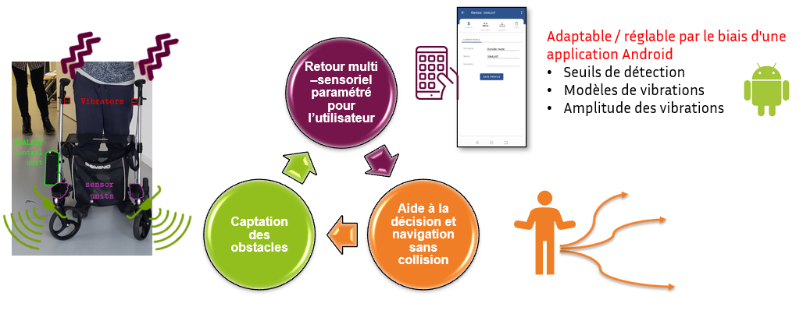
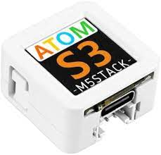

# 1. - Table des matières
- [1. - Table des matières](#1---table-des-matières)
- [2. Swalkit: "Smart Walker Kit"](#2-swalkit-smart-walker-kit)
- [3. Fabriquer son kit en quelques étapes](#3-fabriquer-son-kit-en-quelques-étapes)
  - [3.1. Les outils](#31-les-outils)
  - [le materiel](#le-materiel)
- [4. Publications](#4-publications)
- [5. Experimentations](#5-experimentations)
- [6. Credits (clic on image)](#6-credits-clic-on-image)

# 2. Swalkit: "Smart Walker Kit"

Le Swalkit est un kit open source de déambulateur intelligent pour fournir une aide à la navigation par retour haptique aux personnes déficientes visuelles et motrices

Le kit se compose:
- d'un ensemble de capteurs positionnés près des roues avant du déambulateur. Ceux-ci detectent une information simple: la distance entre l'avant du capteur et un éventuel obstacle jusqu'à 80 cm devant. Ils permettent de détecter les obstacles devant et sur les côtés du déambulateur.

- de deux moteurs vibrants, au niveau des poignées. Ceux-ci sont contrôllés en fonction de l'environment detecté par les capteurs. Ils offrent un retour haptique par vibrations sur les poignées du déambulateur afin d’informer l’usager de la position et la distance des obstacles.

Le kit proposé est:
- Reproductible et adaptable sur des aides techniques existantes
- Intuitif dans sont utilisation
- Personnalisable
- à faible coût

Une application android permet de configurer le comportement des moteurs. Ainsi, il est possible de définir différents profils pour différents utilisateurs et différents contextes.
On définit d'abord quatres zones de detection: loin, proche, très proche, et frontal. Ces zones de detection sont définies par des distances pramétrées par l'application android.
Il est possible ensuite de paramétrer le comportement des  moteurs en fonction de chaque zone de detection, en choisissant une intensité de vibration et une periode de pulsation. Par exemple, on peut définir uen faible intensité et pas de pulsation dans une zone lointaine, qu'on peut définir à au delà de 70cm par exemple. On peut aussi définir une pulsation rapide, de l'ordre de 100ms, pour le cas frontale, et une pulsation plus longue, par exemple 200ms, pour le cas très proche.

https://user-images.githubusercontent.com/100538879/157646195-c86fd216-0dd4-412f-9931-ac7addbbb123.mp4

Le reste de la page indique comment fabriquer son kit, et les publications dont le kit à fait l'objet.
L'ensemble des sources sont disponible sur ce dépot.

> **Attention: clause de non-responsabilité
> La chaire IH2A décline toute responsabilité pour les dommages ou les pertes causés par la fabrication de votre kit. Nous ne fabriquons pas de kit et ne fournissons pas de kit. Nous fournissons uniquement les indications de montage et d'assemblage, ainsi qu'une liste de composants. Nous ne pouvons en aucun cas être responsable des malfaçons ou des problèmes liés à la malfaçon de votre kit.**

# 3. Fabriquer son kit en quelques étapes

## 3.1. Les outils

La table suivante indique la liste des outils premettant la fabrication d'un kit :

|   Nom             |     Pour quoi faire?                                                |    Remarques   |
|-----------|-|-|
|   Un ordinateur (windows de preference)   |  Téléverser le programme dans le micro-controlleur M5Stack AtomS3   |  utiliser l'outil de flashage fourni                                    |
|                   |    Adapter les modèles 3D                                           |  utliliser un logiciel de modelisation 3d (fusion360, solidworks...)    |
|   Une imprimante 3D    |   Imprimer les boitiers et interfaces mécanique                |  une imprimante petit format fera l'affaire         |
|   Un fer à souder    |   Il y a des points de soudure à faire sur une carte pcb pour définir des addresses différentes aux bus i2c intelligent  |           |
|    |   Il faut souder des câbles sur les moteurs  |           |
|   Un petit tournevis cruciforme |   Pour ouvrir et ferme les différents boitiers  |           |

## le materiel

La table suivante indique la liste du materiel à commander, necessaire à la fabrication d'un kit :

|   Nom     |    Pour quoi faire?   |    fournisseur    |   quantité nécéssaire    |     Aperçu     |
|-|-|-|-|-|
|M5Stack AtomS3|C'est le micro-controlleur central qui gère les capteurs, les moteurs, la logique, la communication bluetooth...|[shop M5Stack](https://shop.m5stack.com/products/atoms3-dev-kit-w-0-85-inch-screen);       [gotronic](https://www.gotronic.fr/art-module-atoms3-dev-kit-c123-37089.htm)|1| 
 |
|Batterie|||1||
|Smart Hub i2c|||2||
|Hub i2c simple|||1||
|Pont en H|||2||
|Moteur LMA|||2||
|Capteur "Time of flight" VL53L0X|||8||
|Cable grove court|||11||
|Cable grove long|||2||
|Cable usbc|||1||
|Cable d'alimentation moteur|||2 mètres||
|Bobine PLA|||<1kg||
|Visserie|||-||
|Colle forte|||-||
|Déambulateur|||1||

# 4. Publications

# 5. Experimentations

# 6. Credits (clic on image)

