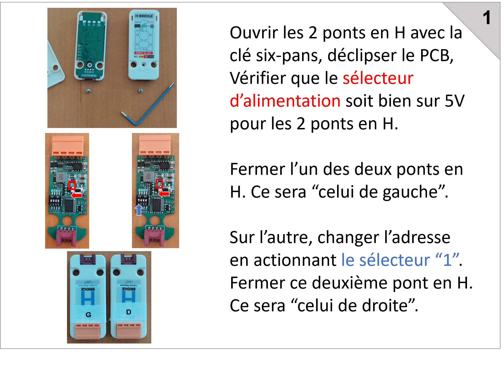
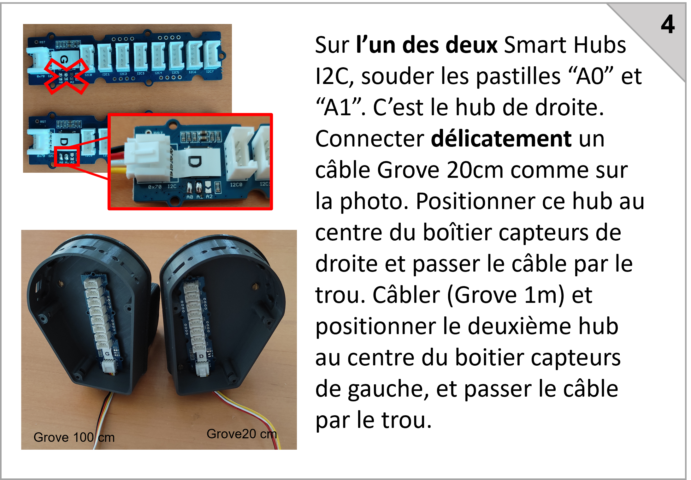
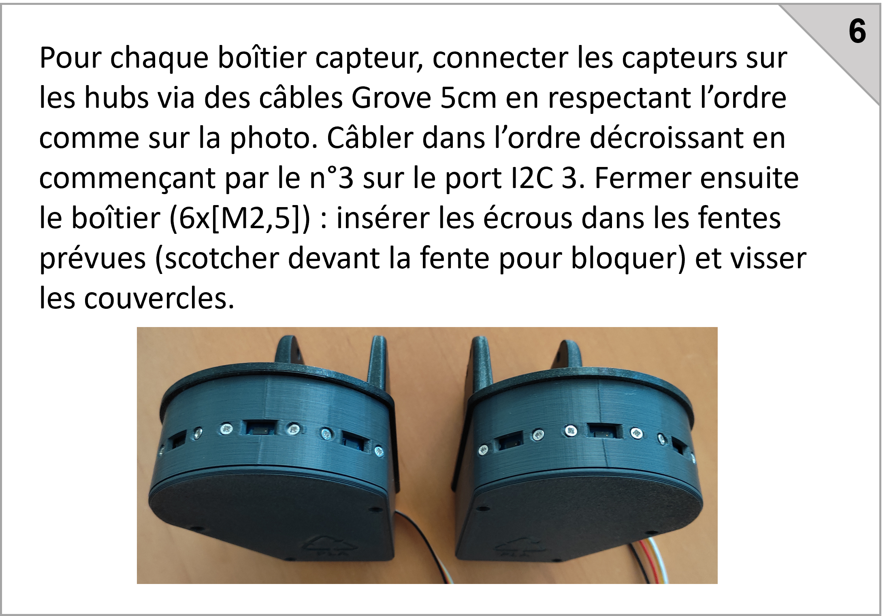
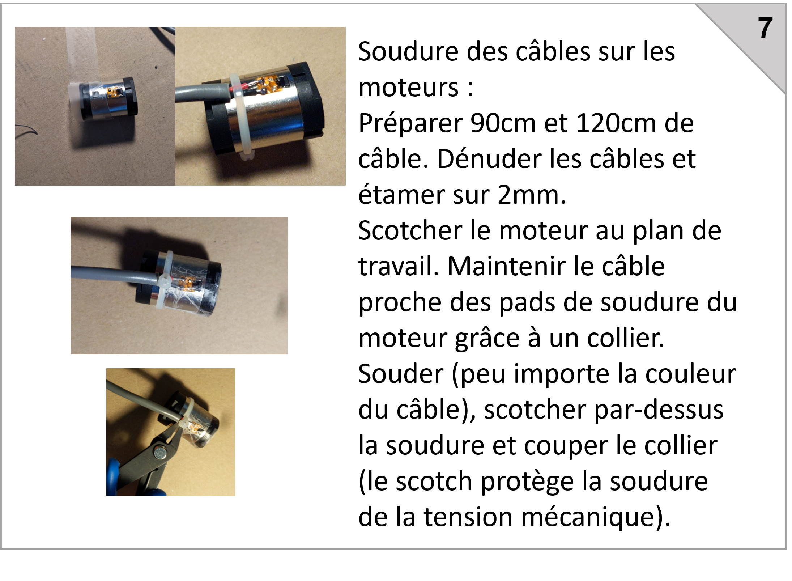
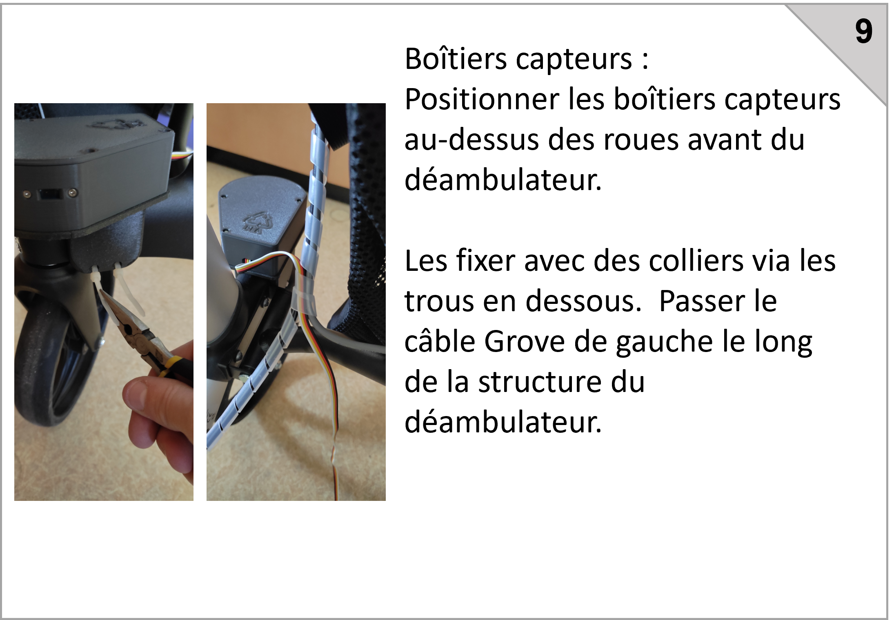
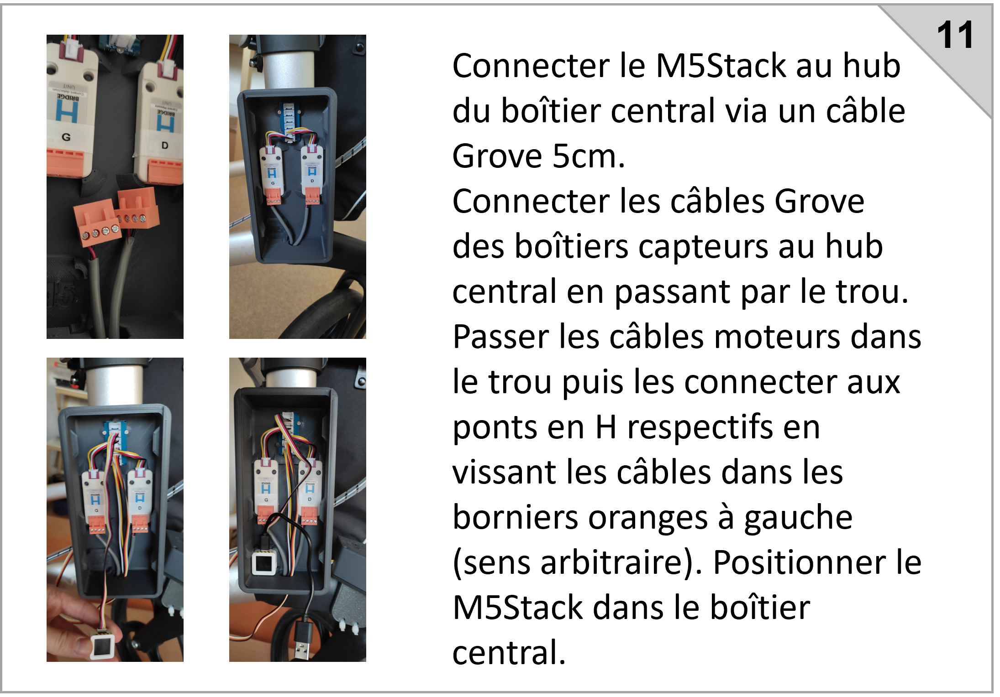
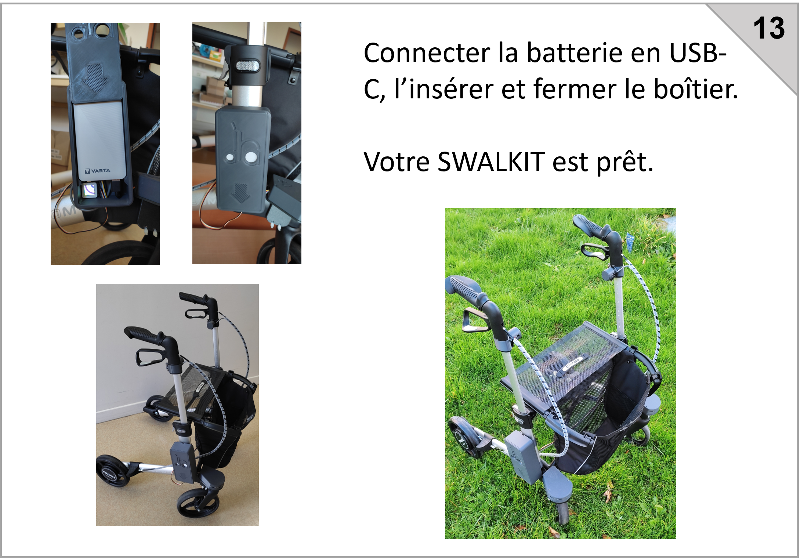
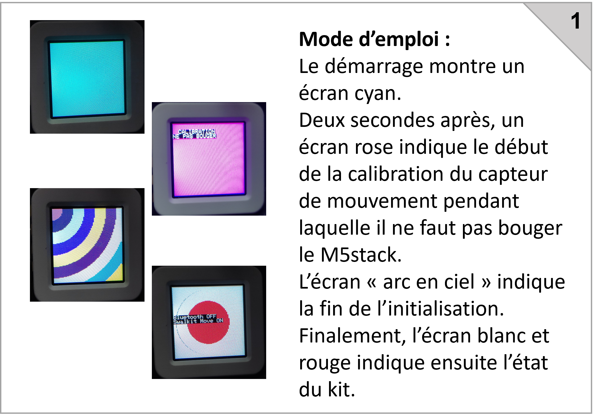
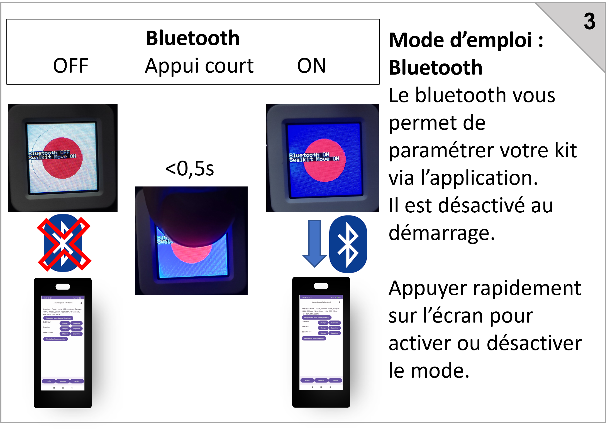
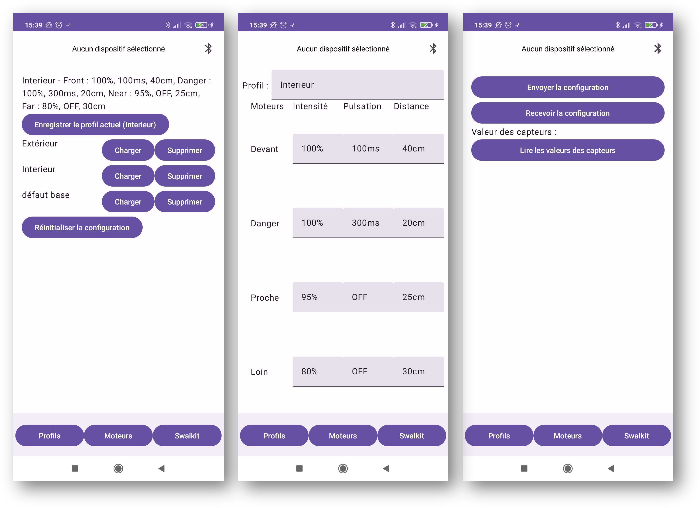

https://user-images.githubusercontent.com/100538879/157646195-c86fd216-0dd4-412f-9931-ac7addbbb123.mp4

> **Responsabilité  
Toute la documentation est fournie "en l'état", la chaire IH2A ne fournit aucune garantie de quelque élément que ce soit, qu'il soit explicite, implicite ou statutaire, y compris, mais sans s'y limiter, toute garantie de qualité marchande ou l’adéquation à un usage particulier ou toute garantie que le contenu des articles sera sans erreur. La chaire IH2A ne peut en aucun cas engager sa responsabilité pour tout dommage direct ou indirect, ou dommages découlant de l’utilisation de la documentation des projets partagés sur cette plateforme.**

> **Avertissement  
Les objets/projets présentés sur cette plateforme le sont UNIQUEMENT ET EXCLUSIVEMENT à titre d'informations, d'enseignements et d'exploration des possibilités du prototypage réalisable en fablab. Leur mise en avant ne constitue en aucun cas un conseil de professionnel quant à leur usage, elle ne remplace pas l'avis d'un spécialiste médical ou paramédical seul en mesure d'évaluer, de conseiller et de proposer des matériels, imprimés ou non, correspondant à une situation et des besoins précis et personnels faisant suite à la réalisation d'un bilan complet.**

> **Le Github de la chaire IH2A ([https://github.com/IH2A/](https://github.com/IH2A/)) ainsi que toutes les autres plateformes associées à la documentation de nos projets (site de communication de la chaire IH2A, [https://ih2a.insa-rennes.fr/](https://ih2a.insa-rennes.fr/)) sont le reflet de travaux de recherche appliqués aux aides technologiques au sein d'une chaire académique de recherche et de l'intérêt professionnel pour les possibilités offertes par le prototypage collaboratif en fablab.**

> **La situation de handicap est délicate et complexe et doit être évaluée et accompagnée par des professionnels.**

> **Sauf mention contraire, tous les contenus de ce projet sont sous licence [EUPL 1.2](https://eupl.eu/1.2/fr/).**
-----------------------------------------------------------------------------------------------------------------

# 1. Table des matières
- [1. Table des matières](#1-table-des-matières)
- [2. Swalkit : "Smart Walker Kit"](#2-swalkit--smart-walker-kit)
- [3. Étapes de fabrication du Swalkit](#3-étapes-de-fabrication-du-swalkit)
  - [3.1. Les outils](#31-les-outils)
  - [3.2. Le matériel](#32-le-matériel)
  - [3.3. Vue d'ensemble](#33-vue-densemble)
  - [3.4. Notice de montage](#34-notice-de-montage)
  - [3.5. Mode d'emploi du M5 stack](#35-mode-demploi-du-m5-stack)
  - [3.6. Application Android](#36-application-android)
- [4. FAQ](#4-faq)
- [5. Publications](#5-publications)
- [6. Crédits](#6-crédits)

# 2. Swalkit : "Smart Walker Kit"

Le "Swalkit" est un kit open source de "déambulateur intelligent". Il a été développé dans le cadre des travaux de recherche sur l'aide à la navigation par retour haptique pour les personnes utilisatrices de déambulateur ayant des déficiences visuelles, au sein de la [chaire académique IH2A]([url](https://ih2a.insa-rennes.fr/)) (Innovations, Handicap, Autonomie et Accessibilité) portée par l'INSA Rennes. Le dispositif "Swalkit" est reproductible : ce dépôt vise à fournir toutes les informations nécessaires afin de pouvoir explorer les possibilités du prototypage réalisables en fablab.

Le kit "Swalkit" est en effet :
- reproductible et adaptable sur des aides techniques existantes ;
- intuitif et facile à prendre en main ;
- personnalisable ; 
- à faible coût.

Le fonctionnement du kit repose sur le retour haptique fourni par les poignées du déambulateur qui informe l'usager de la position des obstacles lors de la déambulation. 
Il est composé de 3 ensembles à fixer sur l'aide technique à équiper : 
- capteurs ;
- moteurs vibrants ;
- unité de contrôle. 

Les capteurs mesurent des distances jusqu'à 80cm. Ils sont positionnés à l'avant du déambulateur, dans des boîtiers imprimés en 3D disposés de chaque côté, afin de permettre la détection d'obstacles devant le déambulateur et sur les côtés. Les moteurs vibrants sont positionnés au plus proches des poignées dans des boîtiers imprimés en 3D. L'unité de contrôle récupère les mesures de distances effectuées par les capteurs puis envoie un signal à chaque moteur pour les activer afin de signaler la présence d'un obstacle à l'usager par vibration de la poignée dans sa main.

Une app mobile Android permet de personnaliser la configuration du comportement des moteurs. Ainsi, il est possible de définir plusieurs profils pour différents usagers et différents contexte d'usage (exemple : intérieur, extérieur, domicile, etc.).

Le reste de la page indique comment fabriquer son kit, et les publications scientifiques dont le kit a fait l'objet.
L'ensemble des sources est disponible sur ce dépot.

> **Attention  
> La chaire IH2A ne fabrique pas de kit et ne fournit pas de kit. Seules les indications de montage et d'assemblage, ainsi qu'une liste de composants, sont indiquées dans ce dépôt.**

# 3. Étapes de fabrication du Swalkit

## 3.1. Les outils

La table suivante indique la liste des outils permettant la fabrication d'un kit :

|   Quel outil ?   |     Pour quoi faire ?                                               |    Remarques   |
|-----------|-|-|
|   Un ordinateur sous Windows    |  Téléverser le programme dans le microcontrôleur M5Stack AtomS3   |  Utiliser l'outil de téléversement fourni (cf [tutoriel](#33-vue-densemble))                                   |
|                   |    Adapter les modèles 3D                                           |  Utliliser un logiciel de modelisation 3d (Fusion360, Solidworks...)    |
|   Une imprimante 3D    |   Imprimer les boîtiers et interfaces mécaniques               |  Une imprimante petit format fera l'affaire         |
|   Un fer à souder    |   Il y a des points de soudure à faire sur une carte PCB pour assigner des adresses différentes aux bus I2C intelligents  |           |
|    |   Il faut souder des câbles sur les moteurs  |           |
|   Un petit tournevis cruciforme |   Pour ouvrir et fermer les différents boîtiers et fixer les capteurs |           |

## 3.2. Le matériel

La table suivante indique la liste du matériel à commander, nécessaire à la fabrication d'un kit :

|   Nom     |    Nom exact |  Pour quoi faire?   |    Fournisseur    |   Quantité nécéssaire    |     Aperçu     | Prix unitraire indicatif |
|-|-|-|-|-|-|-|
|AtomS3|M5Stack AtomS3| C'est le microcontrôleur central qui gère les capteurs, les moteurs, la logique, la communication Bluetooth...|[shop.m5stack](https://shop.m5stack.com/products/atoms3-dev-kit-w-0-85-inch-screen); [gotronic](https://www.gotronic.fr/art-module-atoms3-dev-kit-c123-37089.htm)|1|  | 17,40€|
|Batterie|Varta Power bank energy type 57975|C'est l'alimentation de tout le système|[gotronic](https://www.gotronic.fr/art-batterie-externe-usb-57975-35475.htm)|1| |19,90€|
|Smart Hub I2C|Grove - 8 Channel I2C Hub (TCA9548A)| Ces hubs gèrent les capteurs et permettent de les différencier sur le bus I2C|[gotronic](https://www.gotronic.fr/art-hub-8-ports-I2C-grove-103020293-31770.htm)|2| |8,05€|
|Hub I2C simple|Grove - I2C Hub (6 ports) v1.0|Ce hub permet de connecter l'ensemble des dispositifs sur le même bus I2C|[gotronic](https://www.gotronic.fr/art-hub-6-ports-I2C-grove-103020272-31348.htm)|1| |1,90€|
|Pont en H|Hbridge v1.1 Unit (stm32F030)|C'est un circuit électronique utilisé pour contrôler l'intensité du courant traversant un moteur|[shop.m5stack](https://shop.m5stack.com/products/h-bridge-unit-v1-1-stm32f030)|2||9€|
|Moteur LMA| - |Ce sont les moteur vibrants à positionner près des poignées du déambulateur|[digikey](https://www.digikey.fr/en/products/detail/vybronics-inc/VG2230001H/16719289)|2||7,09€|
|Capteurs TOF| Grove - Time of Flight Distance Sensor (VL53L0X) | Capteur "Time of flight" VL53L0X permettant la détection d'un objet dans une plage de 3 à 100 cm|[gotronic](https://www.gotronic.fr/art-module-grove-time-of-flight-101020532-28252.htm#complte_desc)|8||15,65€|
|Câble grove 5cm| - |Câbles courts pour connecter les composants sur le bus I2C|[digikey](https://www.digikey.fr/en/products/detail/seeed-technology-co-ltd/110990036/5482563)|3 lots de 5||1,91€|
|Câble grove 30cm| - |Câbles longs pour connecter les composants sur le bus I2C|[digikey](https://www.digikey.fr/en/products/detail/seeed-technology-co-ltd/110990040/5482564)|1 lot de 5||2,92€|
|Câble grove 100cm| - |Câbles très longs pour connecter les composants sur le bus I2C|[mouser](https://www.mouser.fr/ProductDetail/M5Stack/A034-D?qs=81r%252BiQLm7BQIX3ZPS9TpAA%3D%3D)|1 lot de 5||1,81€|
|Câble USB-C| - |Pour téléverser le programme, alimenter l'atomS3 et recharger la batterie|[gotronic](https://www.gotronic.fr/art-cordon-10-cm-usbc-0-1-33653.htm)|1||4,30€|
|Câble d'alimentation moteur| - |Pour alimenter les moteurs vibrants|à titre indicatif: [gotronic](https://www.gotronic.fr/art-câble-blinde-cbp225-5075.htm)|2 mètres||~1€/m|
|Bobine PLA| - |Pour imprimer les boîtiers|à titre indicatif : [arianeplast](https://www.arianeplast.com/3d-filament-recycle/195-pla-recycle-couleur-metallise-filament-175mm.html)|<1kg||~20€/kg|
|Visserie| - |Pour l'assemblage|[M3x8mm = 6 M3x15mm = 14 Écrous M3 = 20 M2x8mm = 25 Écrous M2 = 16](https://www.bricovis.fr/produit-vis-a-tete-fraisee-hexagonale-creuse-filetage-total-inox-a2-din-7991-tfhca2/)|-||
|Gaine spirale| - |Pour organiser les câbles|[leroy merlin](https://www.leroymerlin.fr/produits/electricite-domotique/rallonge-multiprise-enrouleur-et-cable-electrique/gaine-electrique-icta/gaine-spirale-p.html)|2 mètres||
|Scotch| - |Pour coller les moteurs||-||
|Déambulateur| - |Le gemino est utilisé comme base||1||615€|

## 3.3. Vue d'ensemble

## 3.4. Notice de montage

> Note de première mise en route : Lorsque le programme est téléversé le M5stack démarre. Celui-ci commence à communiquer avec les différents modules. Les ponts en H ont besoin d'être mis à jour pour contrôler correctement les moteurs. En effet, ces moteurs ont besoin d'une alimentation qui alterne son sens à 70Hz pour fonctionner correctement. Or, le programme de ces ponts en H alterne le sens du courant à la demande. **Nous mettons à jour ce programme automatiquement via le M5Stack et la communication I2C** pour que l'alternance de sens soit gérée directement dans le pont en H.

<a href="../../raw/master/Installation/M5Stack%20flash/flash_download_tool_3.9.5.exe" target="_blank">Outil de mise à jour</a> 
<a href="../../raw/master/Installation/M5Stack%20flash/full_firmware_AtomS3.bin" target="_blank">Microcode</a> 

## 3.5. Mode d'emploi du M5 stack

## 3.6. Application Android

L'application Android permet de :
- Définir des profils
- Sélectionner un profil pour le modifier, ou l'envoyer au kit
- Lire les données des capteurs
  

Le Bluetooth du kit est désactivé au démarrage. Il faut appuyer sur l'écran du M5Stack AtomS3 (qui est en fait un bouton). L'écran de l'AtomS3 devient alors bleu. Vous pouvez alors appairer votre téléphone avec le kit dans vos paramètres Bluetooth.

Une fois que celà est fait vous pouvez télécharger le [fichier d'installation (.apk) de l'application](https://github.com/IH2A/Swalkit/raw/master/Installation/App/app-release.apk).

Une fois l'installation faite, vous pouvez vous connecter au kit en sélectionnant l'icône Bluetooth de l'application.

La première page permet de gérer les profils, les sélectionner, les enregistrer, les réinitialiser.

La deuxième page permet de modifier le profil sélectionné. Une fois modifié, il faut penser à l'enregistrer sur la première page.

La dernière page permet d'envoyer le profil courant au kit, de recevoir la configuration courante du kit, ou de lire les valeurs des capteurs au moment où on appuie sur le bouton associé à la lecture des capteurs.

Il peut être judicieux d'appuyer sur l'écran de l'AtomS3 pour désactiver la communication Bluetooth une fois la configuration faite, bien que celle-ci soit peu gourmande en energie (BLE). L'AtomS3 garde la dernière configuration en mémoire lorsque celui ci s'éteint.

# 4. FAQ
>**J'aimerais me procurer un SWALKIT, comment faire?**
>
>Le plus simple est de se rapprocher d'un fablab local. Nous fournissons simplement la notice mais ne pouvons faire plus.

>**Mon SWALKIT ne vibre plus après quelques secondes à l'arrêt**
>
>Le SWALKIT ne fait pas vibrer les moteurs lorsque le déambulateur n'a pas bougé depuis plusieurs secondes. Cette option peut être désactivée via un appui long sur l'écran du M5stack.

>**Mon SWALKIT a un comportement étrange**
>
>S'il s'agit d'une première mise en route, vérifiez l'ensemble du câblage. Assurez vous d'avoir donné la bonne addresse à chaque dispositif I2C, une inversion est vite arrivée.
>
>Si ce n'est pas une première utilisation : vérifiez d'abord que vos capteurs fonctionnent. Pour cela utilisez l'application en activant le bluetooth du kit via un appui court sur l'écran du M5stack. Mettez-vous dans un environnement dégagé et appuyez sur le bouton de lecture des capteurs : chaque capteur doit envoyer une valeur entre 70 et 80 (cm). Mettez votre doigt devant un capteur sans occulter les autres, et réappuyez sur le bouton : un des capteurs doit envoyer une valeur faible de l'ordre de quelques cm. La plage de detection des capteur est de 3 cm à 8 cm.
>
>Par ailleurs, le m5AtomS3 peut être perturbé par un bus I2C instable : **n'hésitez pas à le redémarrer en débranchant et rebranchant l'USB-C.**

# 5. Publications

Citer : [GRZESKOWIAK, Fabien, DEVIGNE, Louise, PASTEAU, François, et al. SWALKIT: A generic augmented walker kit to provide haptic feedback navigation assistance to people with both visual and motor impairments. In : 2022 International Conference on Rehabilitation Robotics (ICORR). IEEE, 2022. p. 1-6.](https://hal.science/hal-03709659/document)

Présentation au congrès SOFMER 2022.

# 6. Crédits

Co-financé par [Inria - Défi DORNELL](https://project.inria.fr/dornell/) et [Sopra Steria Mission Handicap](https://www.missionhandicap.soprasteria.com/).

Auteurs principaux : Fabien GRZESKOWIAK et Thomas VOISIN.

Le swalkit a été développé par [la chaire IH2A.](https://ih2a.insa-rennes.fr/)

