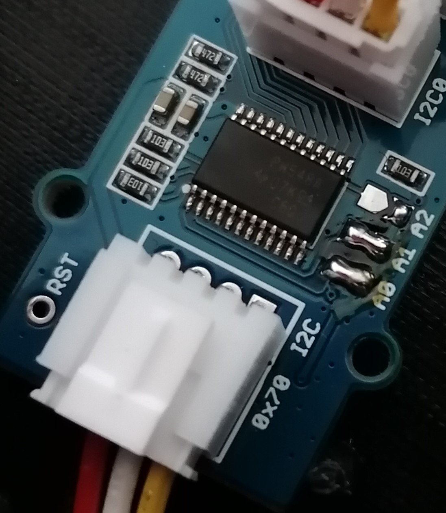
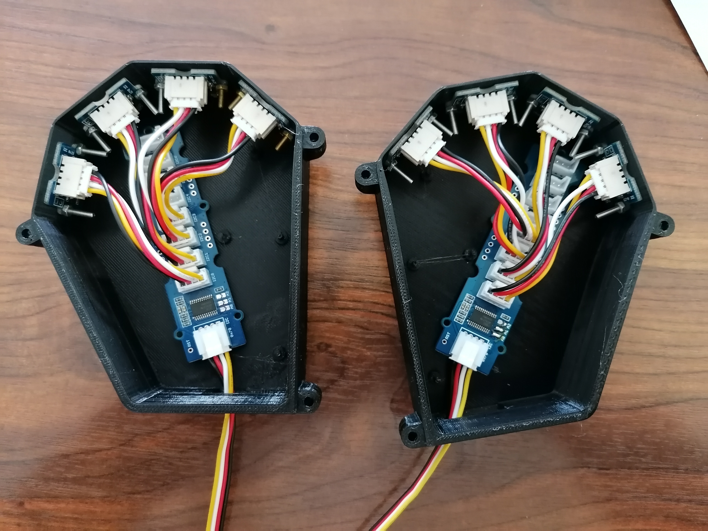
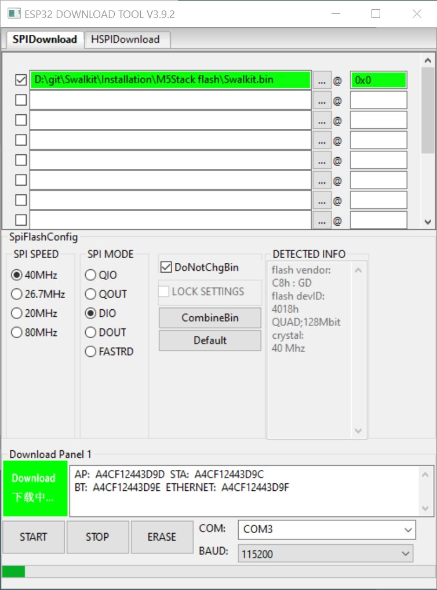

https://user-images.githubusercontent.com/100538879/157646195-c86fd216-0dd4-412f-9931-ac7addbbb123.mp4

# 1. - Table des matières
- [1. - Table des matières](#1---table-des-matières)
- [2. Swalkit : "Smart Walker Kit"](#2-swalkit--smart-walker-kit)
- [3. Fabriquer son kit en quelques étapes](#3-fabriquer-son-kit-en-quelques-étapes)
  - [3.1. Les outils](#31-les-outils)
  - [3.2. Le matériel](#32-le-matériel)
  - [3.3. Vue d'ensemble](#33-vue-densemble)
  - [3.4. Notice de montage](#34-notice-de-montage)
  - [3.5. Câbles et Connections](#35-câbles-et-connections)
    - [3.5.1. Boîtiers capteurs](#351-boîtiers-capteurs)
    - [3.5.2. Boîtiers Moteurs](#352-boîtiers-moteurs)
    - [3.5.3. Boîtier central](#353-boîtier-central)
  - [3.6. Application Android](#36-application-android)
- [4. FAQ](#4-faq)
- [5. Publications](#5-publications)
- [6. Credits (clic sur image)](#6-credits-clic-sur-image)

# 2. Swalkit : "Smart Walker Kit"

Le Swalkit est un kit open source de déambulateur intelligent pour fournir une aide à la navigation par retour haptique aux personnes déficientes visuelles et motrices

Le kit se compose :
- d'un ensemble de capteurs positionnés près des roues avant du déambulateur. Ceux-ci detectent une information simple : la distance entre l'avant du capteur et un éventuel obstacle jusqu'à 80 cm devant. Ils permettent de détecter les obstacles devant et sur les côtés du déambulateur.

- de deux moteurs vibrants, au niveau des poignées. Ceux-ci sont contrôllés en fonction de l'environment detecté par les capteurs. Ils offrent un retour haptique par vibrations sur les poignées du déambulateur afin d’informer l’usager de la position et la distance des obstacles.

Le kit proposé est :
- Reproductible et adaptable sur des aides techniques existantes
- Intuitif dans sont utilisation
- Personnalisable
- À faible coût

Une application Android permet de configurer le comportement des moteurs. Ainsi, il est possible de définir plusieurs profils pour différents utilisateurs et selon le contexte.
On définit d'abord quatres zones de detection : loin, proche, très proche et frontal. Ces zones de detection sont définies par des distances pramétrées par l'application Android.
Il est possible ensuite de paramétrer le comportement des  moteurs en fonction de chaque zone de detection, en choisissant une intensité de vibration et une periode de pulsation. Par exemple, on peut définir une faible intensité et pas de pulsation dans une zone lointaine, qu'on peut définir à au delà de 70cm par exemple. On peut aussi définir une pulsation rapide, de l'ordre de 100ms pour le cas frontal et une pulsation plus longue de l'ordre de 200ms pour le cas très proche.

Le reste de la page indique comment fabriquer son kit, et les publications dont le kit à fait l'objet.
L'ensemble des sources sont disponible sur ce dépot.

> **Attention : clause de non-responsabilité
> La chaire IH2A décline toute responsabilité pour les dommages ou les pertes causés par la fabrication de votre kit. Nous ne fabriquons pas de kit et ne fournissons pas de kit. Nous fournissons uniquement les indications de montage et d'assemblage, ainsi qu'une liste de composants. Nous ne pouvons en aucun cas être responsable des malfaçons ou des problèmes liés à la malfaçon de votre kit.**

# 3. Fabriquer son kit en quelques étapes

## 3.1. Les outils

La table suivante indique la liste des outils premettant la fabrication d'un kit :

|   Nom             |     Pour quoi faire?                                                |    Remarques   |
|-----------|-|-|
|   Un ordinateur (windows de préférence)   |  Téléverser le programme dans le microcontrôleur M5Stack AtomS3   |  Utiliser l'outil de téléversement fourni (cf [tutoriel](#33-vue-densemble))                                   |
|                   |    Adapter les modèles 3D                                           |  Utliliser un logiciel de modelisation 3d (Fusion360, Solidworks...)    |
|   Une imprimante 3D    |   Imprimer les boîtiers et interfaces mécanique                |  Une imprimante petit format fera l'affaire         |
|   Un fer à souder    |   Il y a des points de soudure à faire sur une carte PCB pour définir des adresses différentes aux bus I2C intelligents  |           |
|    |   Il faut souder des câbles sur les moteurs  |           |
|   Un petit tournevis cruciforme |   Pour ouvrir et fermer les différents boîtiers et fixier les capteurs |           |

## 3.2. Le matériel

La table suivante indique la liste du matériel à commander, necessaire à la fabrication d'un kit :

|   Nom     |    Nom exact |  Pour quoi faire?   |    Fournisseur    |   Quantité nécéssaire    |     Aperçu     | Prix unitraire indicatif |
|-|-|-|-|-|-|-|
|AtomS3|M5Stack AtomS3| C'est le microcontrôleur central qui gère les capteurs, les moteurs, la logique, la communication Bluetooth...|[shop.m5stack](https://shop.m5stack.com/products/atoms3-dev-kit-w-0-85-inch-screen); [gotronic](https://www.gotronic.fr/art-module-atoms3-dev-kit-c123-37089.htm)|1|  | 17,40€|
|Batterie|Varta Power bank energy type 57975|C'est l'alimentation de tout le système|[gotronic](https://www.gotronic.fr/art-batterie-externe-usb-57975-35475.htm)|1| |19,90€|
|Smart Hub I2C|Grove - 8 Channel I2C Hub (TCA9548A)| Ces hub gèrent les capteurs et permet de les différencier sur le bus I2C|[gotronic](https://www.gotronic.fr/art-hub-8-ports-I2C-grove-103020293-31770.htm)|2| |8,05€|
|Hub I2C simple|Grove - I2C Hub (6 ports) v1.0|Ce hub permet de connecter l'ensemble des dispositifs sur le même bus I2C|[gotronic](https://www.gotronic.fr/art-hub-6-ports-I2C-grove-103020272-31348.htm)|1| |1,90€|
|Pont en H|Hbridge v1.1 Unit (stm32F030)|C'est un circuit électronique utilisé pour contrôler l'intensité du courant traversant un moteur|[shop.m5stack](https://shop.m5stack.com/products/h-bridge-unit-v1-1-stm32f030)|2||9€|
|Moteur LMA| - |Ce sont les moteur vibrants a positionner près des poignées du déambulateur|[digikey](https://www.digikey.fr/en/products/detail/vybronics-inc/VG2230001H/16719289)|2||7,09€|
|Capteurs TOF| Grove - Time of Flight Distance Sensor (VL53L0X) | Capteur "Time of flight" VL53L0X permettant la détection d'un objet dans une plage de 3 à 100 cm|[gotronic](https://www.gotronic.fr/art-module-grove-time-of-flight-101020532-28252.htm#complte_desc)|8||15,65€|
|Câble grove court| - |Câbles courts pour connecter les composants sur le bus I2C|[digikey](https://www.digikey.fr/en/products/detail/seeed-technology-co-ltd/110990036/5482563)|3 lots de 5||1,91€|
|Câble grove long| - |Câbles longs pour connecter les composants sur le bus I2C|[digikey](https://www.digikey.fr/en/products/detail/seeed-technology-co-ltd/110990027/5482567)|1 lot de 5||2,92€|
|Câble USBC| - |Pour téléverser le programme, alimenter l'atomS3 et recharger la batterie|[gotronic](https://www.gotronic.fr/art-cordon-10-cm-USBC-0-1-33653.htm)|1||4,30€|
|Câble d'alimentation moteur| - |Pour alimenter les moteurs vibrants|à titre indicatif: [gotronic](https://www.gotronic.fr/art-câble-blinde-cbp225-5075.htm)|2 mètres||~1€/m|
|Bobine PLA| - |Pour imprimer les boîtiers|à titre indicatif : [arianeplast](https://www.arianeplast.com/3d-filament-recycle/195-pla-recycle-couleur-metallise-filament-175mm.html)|<1kg||~20€/kg|
|Visserie| - |Pour l'assemblage|M2 et M3|-||
|Colle forte| - |Pour coller les moteurs||-||
|Scotch| - |Pour coller les moteurs||-||
|Déambulateur| - |Le gemino est utilisé comme base||1||615€|

## 3.3. Vue d'ensemble

## 3.4. Notice de montage

>TODO Thomas instructions de montage (tuto photo?)

## 3.5. Câbles et Connections

### 3.5.1. Boîtiers capteurs

Un boîtier de capteurs se compose de 4 capteurs, chacun relié par un câble au smart Hub I2C du boîtier. Un long câble I2C relie le smart Hub au boîtier central. Ce câble en particulier doit être banché sur le connecteur couché, seul de l'autre côté du composant electronique principal : 

Les boîtiers capteurs sont symétriques, à un détail près : l'addresse I2C des Smart Hub. En effet, pour les différencier, il faut souder les pad A0 et A1 sur le smart Hub de droite, juste à côté du composant electronique principal de la carte : 

### 3.5.2. Boîtiers Moteurs

Les moteurs doivent être soudés à un câble 2 voies (par exemple un câble de haut parleur). L'autre côté du câble sera vissé dans un bornier du pont en H.

Le moteur doit être collé au fond de son receptacle et le câble doit être protégé pour éviter l'arrachement (nous utilisons du scotch).

Les boîtiers droite et gauche sont symétriques et les étapes de montage sont identiques.

Voir la section concernant [l'assemblage mécanique](#34-impressions-3d-et-assemblage-mécanique).

> TODO Photo moteur monté

### 3.5.3. Boîtier central

Sur le hub I2C simple central, il faut brancher :
- le m5stack atomS3, avec un câble grove court
- les deux Smart hub I2C venant des boîtiers capteur
- les deux ponts en H du boîtier central, avec un câble grove court

Les ponts en H doivent être démontés pour enclencher les switchs. Un premier switch sert à indiquer qu'il faut utiliser le 5V et non pas une alimentation externe.
Le deuxième sert à mettre une addresse différente de l'addresse par défaut. Sur le pont en H de droite, enclenchez le premier switch d'addresse pour mettre l'addresse à 0x21. Ensuite, branchez le câble moteur sur le bornier correspondant (M+ et M- sans importance).

A ce stade, tout les branchements sont fait. Il faut maintenant téléverser le programme dans le M5stack AtomS3. Pour cela, utilisez l'outil de téléversement et les fichier binaires [disponibles ici sur le dépot](./Installation/M5Stack%20flash/AtomS3%20kit/). Si vous êtes familier avec vscode et l'extension vscode platformio, vous préfèrerez peut être utiliser le projet pio dans le dossier developpement et télécharger votre programme via platformio.

> TODO fabien verifier les fichier binaires et le bon fonctionnement de la procédure d'upload

> TODO fabien enlever les anciennes versions du swalkitdans les dossiers dev et install du dépot

> TODO fabien verifier le lien de telechargement direct

Double-cliquez sur le fichier exécutable pour l'exécuter et installer votre programme sur le M5stack (ou M5atom). Une fenêtre s'ouvre, sélectionnez "ESP32" comme type de puce et "develop" comme mode de travail. 

Modifiez le port COM en fonction de votre appareil. Vous pouvez vérifier votre port COM en débranchant et en rebranchant votre appareil, vous devriez voir le port correspondant disparaître et réapparaître dans la liste des ports COM. 

Sélectionnez le fichier binaire ([disponible ici sur le dépot](./Installation/M5Stack%20flash/AtomS3%20kit/)) en cliquant sur les 3 points de la première ligne. Inscrivez l'adresse 0x0 à droite. Activez le fichier en cliquant sur la case à cocher à gauche. 

> TODO fabien verifier le lien de telechargement direct

Cliquez sur "Start" pour télécharger le programme. 

> TODO fabien mettre a jour avec la bonne image

> Note de première mise en route : Lorsque le programme est televersé le M5stack démarre. Celui-ci commence à communiquer avec les différents modules. Les pont en H ont besoin d'être mis à jour pour controller correctement les moteurs. En effet, ces mmoteur ont besoin d'une alimentation qui alterne son sens à 70Hz pour fonctionner correctement. Hors, le programme de ces ponts en H alterne le sens du courant à la demande. **Nous mettons à jour ce programme automatiquement via le M5Stack et la communication I2C** pour que l'alternance de sens soit gérée directement dans le pont en H.

## 3.6. Application Android

L'application Android permet de :
- Définir des profils
- Sélectionner un profil pour le modifier, ou l'envoyer au kit
- Lire les données des capteurs
  

Le Bluetooth du kit est désactivé au démarrage. Il faut appuyer sur l'écran du M5Stack AtomS3 (qui est en fait un bouton). L'écran de l'AtomS3 devient alors bleu. Vous pouvez alors appairer votre téléphone avec le kit dans vos paramètres Bluetooth.

Une fois que celà est fait vous pouvez télécharger le fichier d'installation (.apk) de l'application disponible [ici](https://github.com/IH2A/Swalkit/raw/app_rework/Installation/App/app-release-unsigned.apk).

Une fois l'installation faite, vous pouvez vous connecter au kit en sélectionnant l'icône Bluetooth de l'application.

La première page permet de gérer les profils, les sélectionner, les enregistrer, les réinitialiser.

La deuxième page permet de modifier le profil sélectionné. Une fois modifié, il faut penser à l'enregistrer sur la première page.

La dernière page permet d'envoyer le profil courant au kit, de recevoir la configuration courante du kit, ou de lire les valeurs des capteurs au moment où on appuie sur le bouton associé à la lecture des capteurs.

Il peut être judicieux d'appuyer sur l'écran de l'AtomS3 pour désactiver la communication Bluetooth une fois la configuration faite, bien que celle-ci soit peu gourmande en energie (BLE). L'AtomS3 garde la dernière configuration en mémoire lorsque celui ci s'éteint.

# 4. FAQ
>**J'aimerai me procurer un SWALKIT, comment faire?**
>
>Le plus simple est de se rapprocher d'un fablab local. Nous fournissons simplement la notice mais ne pouvons faire plus.

>**Mon SWALKIT ne vibre plus après quelques secondes à l'arrêt**
>
>Le SWALKIT ne fait pas vibrer les moteurs lorsque le déambulateur n'a pas bougé depuis plusieurs secondes. dev tip: Cette option peut être désactivée dans le programme source via une variable booleenne "bool imu_enable" au début du fichier main.cpp.

>**Mon SWALKIT a un comportement étrange**
>
>S'il s'agit d'une première mise en route, vérifiez l'ensemble du câblage. Assurez vous d'avoir donné la bonne addresse à chaque dispositif I2C, un inversion est vite arrivée.
>
>Si ce n'est pas une première utilisation : vérifiez d'abord que vos capteurs fonctionnent. Pour cela utilisez l'application. Mettez vous dans un environnement dégagé, et appuyez sur le bouton de lecture des capteurs : chaque capteur doit envoyer un valeur entre 70 et 80 (cm). Mettez votre doigt devant un capteur sans occulter les autres, et réappuyez sur le bouton : un des capteurs doit envoyer une valeur faible de l'ordre de quelques cm. La plage de detection des capteur est de 3 cm à 8 cm.
>
>Par ailleurs, le m5AtomS3 peut être perturbé par un bus I2C instable : **n'hésitez pas à le redémarer en appuyant sur le bouton latéral.**

# 5. Publications

Citer : [GRZESKOWIAK, Fabien, DEVIGNE, Louise, PASTEAU, François, et al. SWALKIT: A generic augmented walker kit to provide haptic feedback navigation assistance to people with both visual and motor impairments. In : 2022 International Conference on Rehabilitation Robotics (ICORR). IEEE, 2022. p. 1-6.](https://ieeexplore.ieee.org/abstract/document/9896406/)

Présentation au congrès [SOFMER 2022.](https://programme.sofmer2022.com/abstract.php?action=planningView&id=93023)

# 6. Credits (clic sur image)
Auteurs principaux : Fabien GRZESKOWIAK et Thomas VOISIN. 

